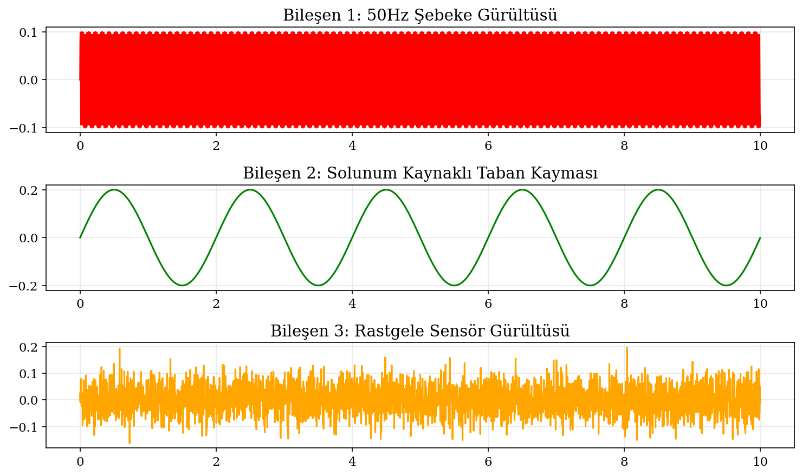
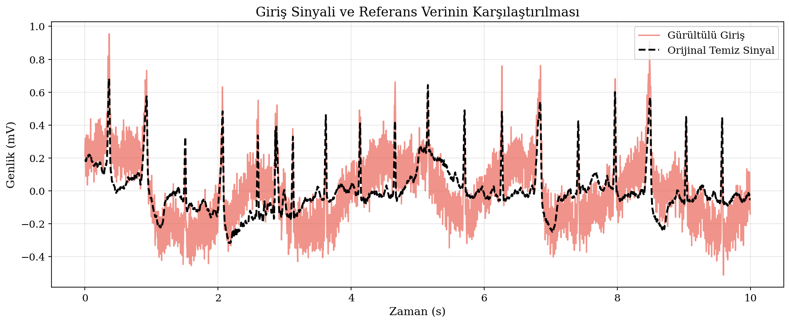
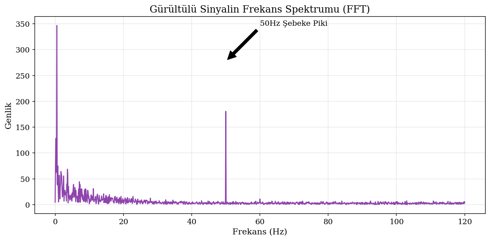
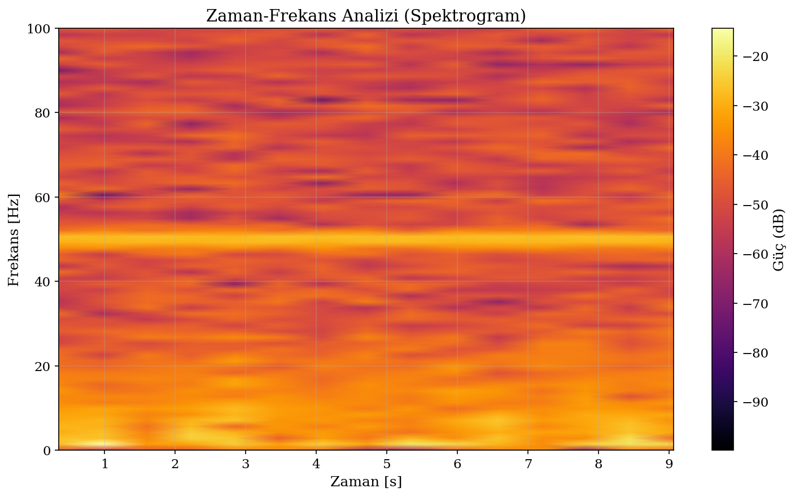
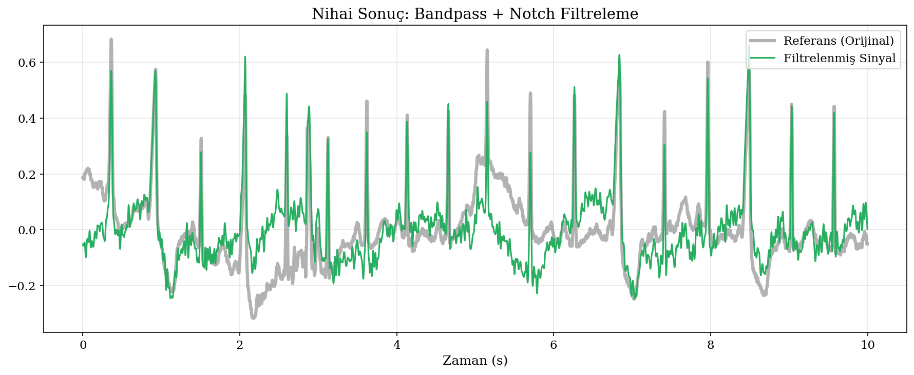
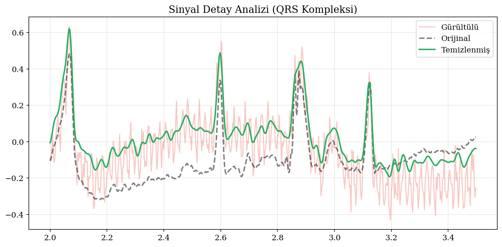
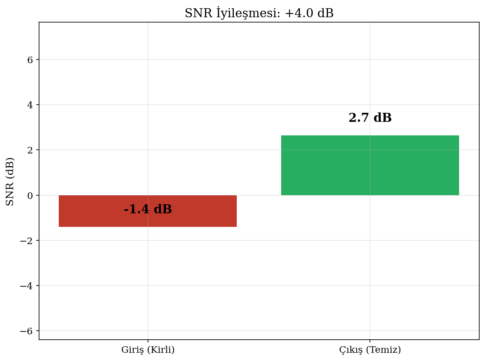
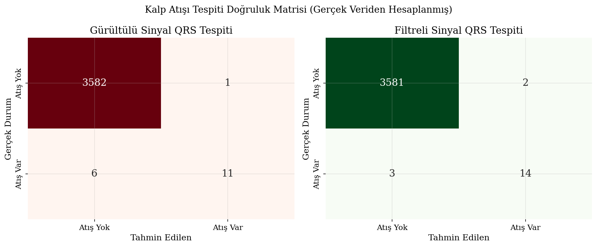

# Biomedical ECG Signal Processing

An end-to-end Biomedical Signal Processing pipeline in Python that models, filters, and analyzes Electrocardiogram (ECG) signals. The project simulates real-world noise artifacts (50Hz powerline interference, respiration-induced baseline wander, and random sensor noise), applies digital filtering techniques (IIR Notch and Butterworth Bandpass filters), detects QRS peaks (heartbeats), and evaluates performance using Signal-to-Noise Ratio (SNR) gain and classification confusion matrices.

---

## 🚀 Key Features

* **Real-world Noise Simulation**: Models 50Hz powerline interference, slow respiratory baseline drift, and Gaussian sensor noise.
* **Dual-Stage Digital Filtering**:
  * **IIR Notch Filter**: Attenuates 50Hz powerline frequency.
  * **Butterworth Bandpass Filter**: 4th-order filter (0.5Hz - 40.0Hz) to remove baseline wander and high-frequency noise.
* **QRS Peak Detection**: Employs SciPy peak detection to locate heartbeats (R-peaks) on clean, noisy, and filtered signals.
* **Beat-by-Beat Evaluation**: Matches detected peaks to reference peaks within a 50ms (~18 samples at 360Hz) physiological tolerance window to build confusion matrices.
* **SNR Analysis**: Calculates Signal-to-Noise Ratio (SNR) improvement to mathematically measure noise attenuation.
* **Rich Time-Frequency Visualization**: Outputs 9 figures including time-domain signals, FFT frequency spectrums, spectrograms, and confusion matrices.

---

## 🛠️ Signal Processing Pipeline

```
┌────────────────────────────────────────────────────────┐
│ 1. Data Loader: Load SciPy electrocardiogram (360Hz)   │
└───────────────────────────┬────────────────────────────┘
                            ▼
┌────────────────────────────────────────────────────────┐
│ 2. Noise Injector: Model 50Hz, baseline drift & noise   │
└───────────────────────────┬────────────────────────────┘
                            ▼
┌────────────────────────────────────────────────────────┐
│ 3. Digital Filters: Apply 50Hz Notch + Bandpass Filter │
└───────────────────────────┬────────────────────────────┘
                            ▼
┌────────────────────────────────────────────────────────┐
│ 4. Peak Detector: Find R-peaks (heartbeats)            │
└───────────────────────────┬────────────────────────────┘
                            ▼
┌────────────────────────────────────────────────────────┐
│ 5. Evaluator: Calculate SNR gain & Confusion Matrices  │
└────────────────────────────────────────────────────────┘
```

---

## 📊 Sample Visualizations

The pipeline automatically outputs analytical plots to the `Graphics/` directory:

### Simulated Noise Components
Detailed breakdown of the three injected noise artifacts (Powerline, Respiration baseline wander, and Sensor noise):


### Time-Domain Input Comparison
Comparison of the original clean ECG signal versus the noisy corrupted signal:


### Frequency Spectrum (FFT)
Fast Fourier Transform (FFT) showing the prominent 50Hz powerline noise peak:


### Time-Frequency Spectrogram


### Filtering Results (Notch + Bandpass)
Final filtered output compared against the reference clean signal:


### QRS Complex Zoom-In
Detailed zoom on a single heartbeat cycle (QRS complex) comparing original, noisy, and filtered waveforms:


### SNR Gain Metric
Signal-to-Noise Ratio (SNR) improvement before and after filtering:


### Heartbeat Detection Confusion Matrix
Beat-by-beat classification validation of QRS detection on noisy vs. clean signals:


---

## 📁 Repository Structure

```
Biomedical-Ecg-Signal-Processing/
├── Graphics/
│   ├── Sekil_1_Gurultu_Bilesenleri.png
│   ├── Sekil_2_Giris_Karsilastirma.png
│   ├── Sekil_3_FFT_Analizi.png
│   ├── ...
│   └── results.txt                         ← Log of computed SNR and confusion matrix values
├── Biomedical_Ecg_Signal_Processing.ipynb   ← Jupyter Notebook workflow
├── main.py                                  ← Executable Python script pipeline
├── LICENSE                                  ← MIT License
├── requirements.txt                         ← Project dependencies
├── .gitignore                               ← Git ignore file
└── README.md                                ← Project documentation (This file)
```

---

## ⚙️ Quick Start

### Prerequisites
* Python 3.8 or higher.

### Installation
1. Navigate into the cloned directory:
   ```bash
   cd Biomedical-Ecg-Signal-Processing
   ```
2. Install dependencies:
   ```bash
   pip install -r requirements.txt
   ```

### Running the Pipeline
Run the main script to run the filter, compute metrics, and output the charts to `Graphics/`:
```bash
python main.py
```

---

## 📄 License

Distributed under the MIT License. See `LICENSE` for more information.
